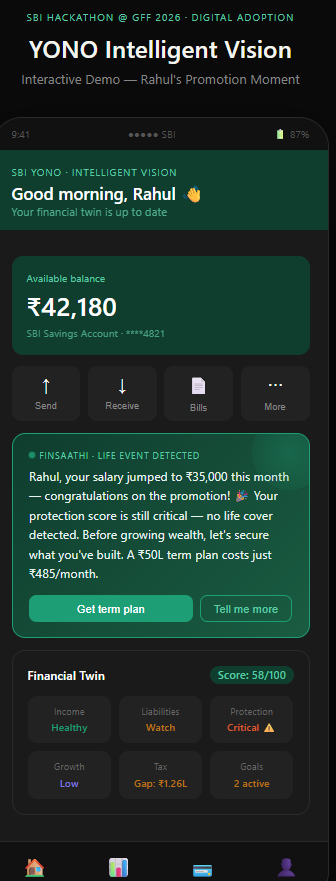
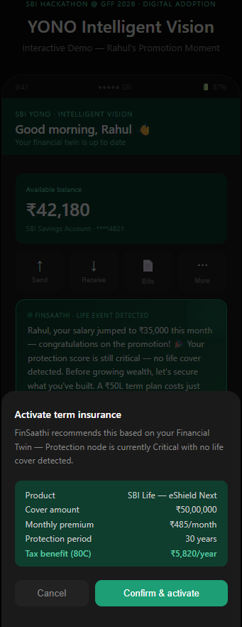
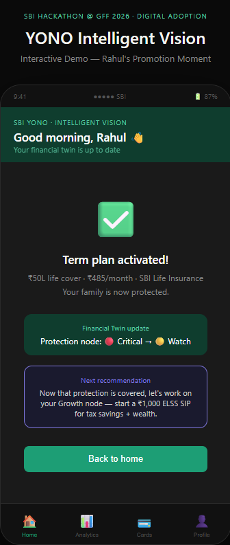

# YONO Intelligent Vision

> **SBI Hackathon @ GFF 2026 � Digital Adoption Track**

YONO Intelligent Vision is an agentic AI layer embedded inside SBI YONO that detects life-stage transitions, builds a live Financial Twin, and delivers narrative analytics. It turns YONO from a transaction utility into a proactive financial advisor for every Indian user.

---

## Overview

- Detects important life-stage signals from financial activity and documents.
- Builds a live six-node Financial Twin to model income, liabilities, protection, growth, tax, and goals.
- Generates actionable narrative analytics and recommendations.
- Supports trust-gated agentic interactions for observer, advisor, and co-pilot modes.

---
## Problem

YONO is used by millions daily, but most users only access payments and UPI features. The platform rarely surfaces the right financial recommendation at the right life stage, so users miss investment, insurance, and savings opportunities.

## Solution

YONO Intelligent Vision detects life-stage triggers from transactions, account aggregator data, document signals, and user behavior. It creates a live Financial Twin and delivers personalized narrative analytics that help users act when the opportunity is most relevant.

## Repository Structure

```text
yono-intelligent-vision/
  backend/           # FastAPI backend
    app/
      agents/        # Agent definitions and orchestration
      models/        # Data models and domain schemas
      routes/        # API endpoints
      services/      # Business logic and workflows
  frontend/          # React / Expo frontend and UI
    src/
      components/    # Reusable UI components
      screens/       # Application views
      utils/         # Helpers and API clients
  demo/              # Standalone HTML demo for quick preview
  docs/              # Architecture and API reference documentation
  docker-compose.yml # Local deployment helpers
  LICENSE            # Project license
```
## Quick Start

### Option 1 � Run the HTML demo
```bash
# Open demo/index.html in a browser
```

### Option 2 � Run the backend API
```bash
cd backend
pip install -r requirements.txt
# configure environment variables
uvicorn app.main:app --reload
```

### Option 3 � Run the frontend
```bash
cd frontend
npm install
npx expo start
```

---
## Demo Screenshots

Interactive demo screenshots are available in `demo/screenshots`.







---
## Environment Variables

```env
ANTHROPIC_API_KEY=your_key_here
BHASHINI_API_KEY=your_key_here
NEO4J_URI=bolt://localhost:7687
NEO4J_USER=neo4j
NEO4J_PASSWORD=password
```

---

## Core Features

- Signal Intelligence Engine for life-stage event detection.
- Financial Twin with six live health nodes.
- Narrative Analytics Engine with Money Story, Spend DNA, Goal Runway, Cash Flow Forecast, Tax Radar, Habit Loop, Decision Simulator, and Discipline Score.
- Trust-gated agentic experiences: Observer, Advisor, and Co-pilot.
---

## Tech Stack

| Layer | Technology |
|-------|------------|
| Frontend | React Native, Expo |
| Agent Brain | Claude Sonnet 4.6, LangGraph, LangChain |
| Signal Engine | Python, FastAPI, Scikit-learn, XGBoost |
| Financial Twin | Neo4j, graph modeling |
| Analytics | Python, data science models, narrative generation |
| Voice | Bhashini STT/TTS |
| Backend | FastAPI, PostgreSQL, Redis |
| Infrastructure | Docker, docker-compose |

---

## API Highlights

| Method | Endpoint | Description |
|--------|----------|-------------|
| POST | `/api/v1/twin/build` | Build the user Financial Twin |
| GET | `/api/v1/twin/{user_id}` | Retrieve the current Twin state |
| POST | `/api/v1/signals/detect` | Detect life-stage events |
| POST | `/api/v1/agent/recommend` | Get an AI recommendation |
| POST | `/api/v1/analytics/money-story` | Generate narrative Money Story |

---

## Compliance

- RBI Account Aggregator framework
- SEBI MF Central integration
- DigiLocker document signals
- DPDP Act 2023 awareness
- RBI regulatory sandbox readiness

---

## License

This project is licensed under the MIT License. See [LICENSE](LICENSE) for details.
